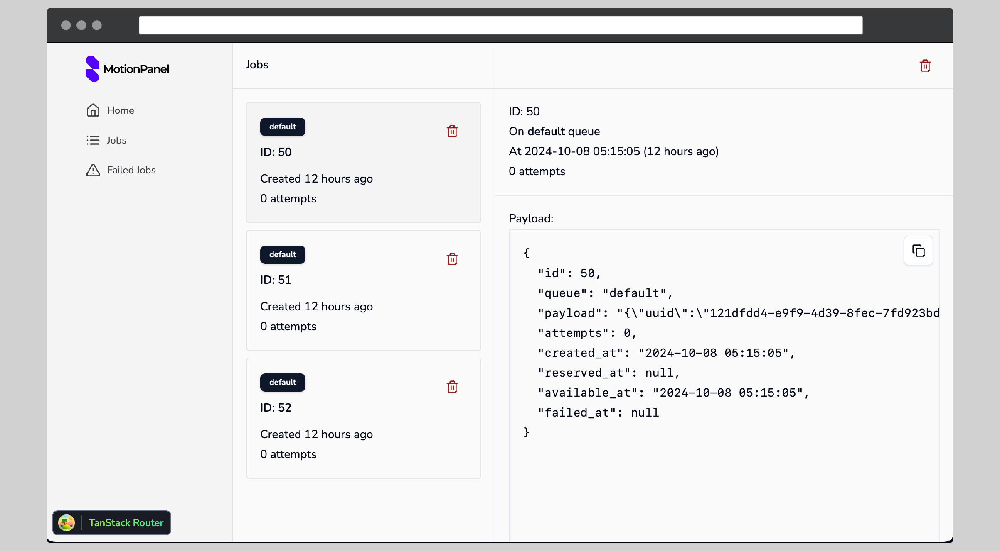

# Motion Panel for Laravel

> Notes: Currently, only Laravel 9.x, 10.x, and 11.x are supported. Newer versions need to be tested.
> If you need to support versions older than Laravel 9.x, you're welcome to create a pull request.

> **Note:** This project is in the very early stages of development. Some features may not be available or fully functional yet.

Motion Panel is an elegant and powerful dashboard designed to help you monitor and manage your Laravel application with ease. Whether you're tracking jobs, monitoring system performance, or debugging routes, Motion Panel provides a comprehensive suite of tools to keep your application running smoothly. Experience seamless integration and enhanced visibility into your application's operations with Motion Panel.



## Installation

```sh
composer require motionpanel/motionpanel-laravel
```

Publish the assets:

```sh
php artisan motionpanel:publish
```

### Authorization

The MotionPanel dashboard may be accessed at the /motionpanel route. By default, you will only be able to access this dashboard in the local environment. Within your app/Providers/MotionPanelLaravelServiceProvider.php file, there is an authorization gate definition. This authorization gate controls access to MotionPanel in non-local environments. You are free to modify this gate as needed to restrict access to your MotionPanel installation:

```php
/**
 * Register the MotionPanel gate.
 *
 * This gate determines who can access MotionPanel in non-local environments.
 *
 * @return void
 */
protected function gate()
{
    Gate::define('viewMotionPanel', function ($user) {
        return in_array($user->email, [
            'tonywei92@gmail.com',
        ]);
    });
}
```

### Todos

#### Phase #0

- [x] ~~Support Middleware for "/motionpanel/_" and "/api/motionpanel/_"~~
- [x] Dashboard authorization
- [x] Release v0.1
- [x] Write installation guide
- [x] Write development guide
- [x] Show tanstack router debugger only in development
- [x] Build UI for exception state (APIs return non-2xx)
- [x] Build Job status page
- [ ] Local-only instalation guide

#### Phase #1

- [x] Jobs monitoring (Database)
- [ ] Jobs filter by date (Database)
- [x] Jobs detailed panel (Database)
- [x] Failed jobs monitoring (Database)
- [ ] Failed jobs filter by date (Database)
- [x] Failed jobs detailed panel (Database)
- [ ] Jobs monitoring (Redis)
- [ ] Force delete regardeless the job running or not
- [ ] Failed jobs monitoring (Redis)
- [x] Test the support for Laravel 9+
- [ ] Syntax highlighting for payload and exception
- [ ] CI to deploy to packagaist

#### Phase #2

- [ ] Router logs

#### Phase #3 (Integrate with Prometheus)

- [ ] CPU load monitoring
- [ ] Memory load monitoring

### Contributing

We welcome contributions! Please see [CONTRIBUTING.md](CONTRIBUTING.md) for guidelines on how to contribute to this project.

### License

This project is licensed under the terms of the MIT license. See [LICENSE.md](LICENSE.md) for details.
